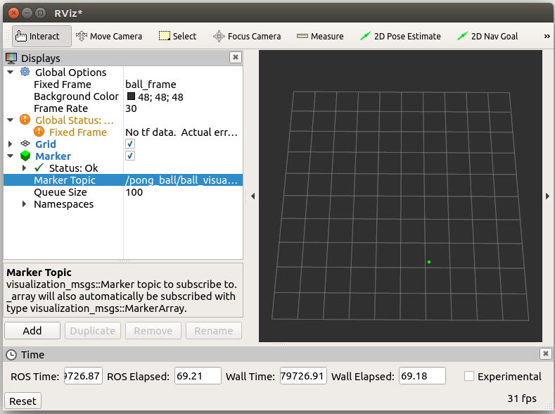

# ROSPong
Pong game created in ROS
For now only contains code which simulates a point ball moving in a constrained space.

Tested on Ubuntu 17.04 running ROS Lunar

## Run
Launch pong ball rosnode with
```
roslaunch pong_ball pong_ball.launch
```
Open Rviz to view ball marker. Configure fixed frame in rviz to "/ball_frame" and add marker which subscribes to "/pong_ball/ball_visualization"  
The view should look like:

